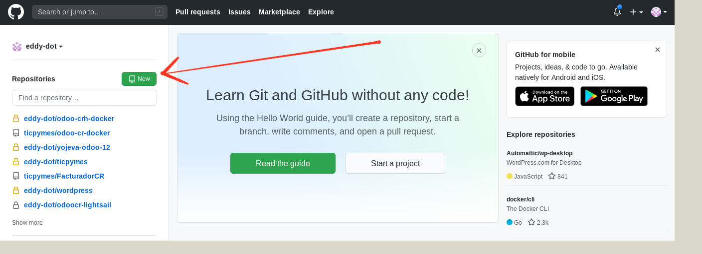
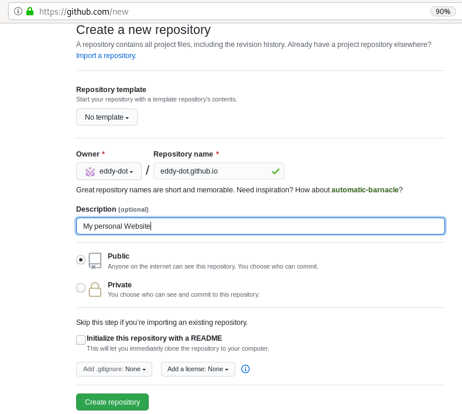
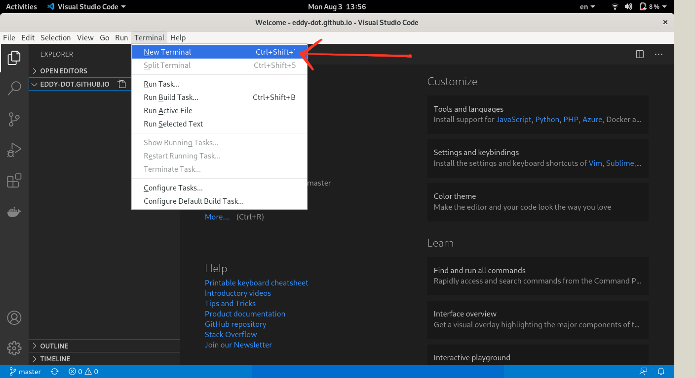
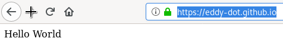

# Git Bash Tutorial


# How to use git bash

Git is a distributed version-control system for tracking changes in source code during software development. It is designed for coordinating work among programmers, but it can be used to track changes in any set of files.

In this tutorial we assume you have the next enviroment:
* Ubuntu 20.04
* Visual Code
* Git

### 1. Create an account in github.com

<br />

### 2. Create a new repository

<br />

 

<br />

 

<br />

### 3. Go to your laptop, open the terminal and clone the repository you just created

<br />

```bash
cd ~/Documents/
git clone https://github.com/{{username}}/{{username}}.github.io.git
```
<br />

For Example:

<br />

```bash
git clone https://github.com/eddy-dot/eddy-dot.github.io.git
```

<br />

### 4. Get into the repository's directory and open Visula Code

<br />

```bash
cd {{user}}.github.io
code .
```
<br />

### 5. Open terminal in Visual code

<br />

 

<br />

### 6. Type the following commands

<br />

```bash
git congif --global user.name "github_username"
git congif --global user.email "github_email"
echo "Hello World" > index.html
git add --all
git commit -m "Initial Commit"
git push -u origin master
```
<br />

### 7. Open a web browser and type https://{{username}}.github.io

<br />

 

<br />

## Commands used in this tutorial:

```bash
git clone
```

>This command is used to obtain a repository from an existing URL.

<br />

```bash    
git config --global user.name/user.email
```

>This command sets the username and email address of your github account.

<br />

```bash    
git status
```

>This command is to check what changes are in the stagging area (green) and what not (red).

<br />

```bash    
git add --all
```

>This command add one or multiple changes (new file, deleted file, updated file) to the staging area. --all means that all changes are added to the staging area. the staging area are the changes reflected in the next commit. If a change shouldn’t be in the staging area, it can be removed with ”git rm file”.

<br />

```bash
git commit -m “message”
```

>This command records or snapshots the changes in the staging area permanently in the version history. -m means that the message in the next “” will be recorded in the commit.

<br />

```bash
git push
```
>This command sends the committed changes of master branch to your remote repository(the one that is in github.com).

<br />

## Other important commands:

<br />

```bash
git branch
```

>Shows available branches.

<br />

```bash
git checkout {{branchname}}
```

>Swith the branch you are working on.

<br />

```bash
git checkout -b {{branchname}}
```

>Swith to a new branch.

<br />

```bash
git  pull
```

>Update local changes with remote repository's changes.

<br />

```bash
git revert {{ffffff}}
```
>Undo changes done in a commit, {{ffffff}} repreents the commit id.

<br />

```bash
git merge {{branchname}}
```

>Updates current branch with a branch changes.

<br />

```bash
git submodule add https://github.com/{{username}}/{{repository}}
```

>Adds a idependent repository as part of current repository.

<br />

```bash
git clone --recurse-submodules
```

>Adds a idependent repository as part of current repository.

<br />
